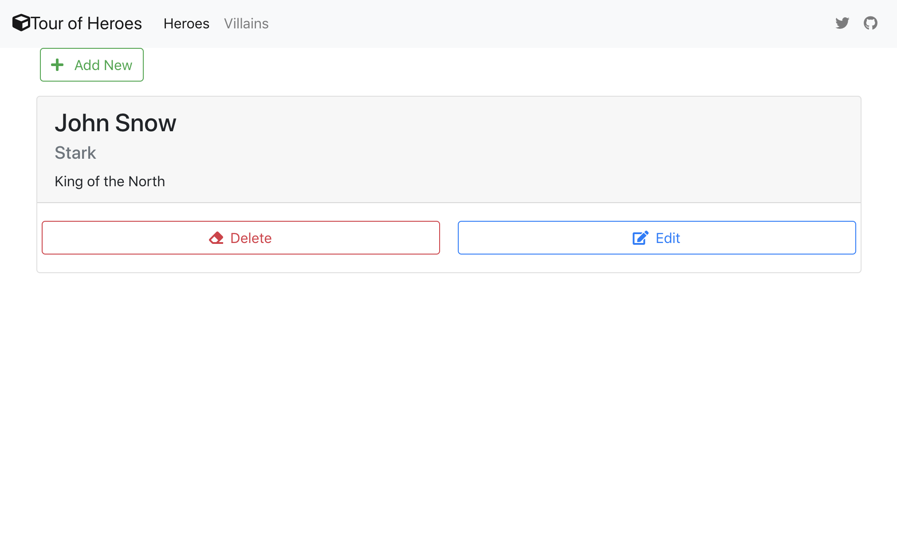

# Nest node framework and MongoDB: Backend service for my Tour of Heroes web and mobile apps.

## How to run

create a database in [Mlab](https://mlab.com/)

```sh
$ git clone https://github.com/webmasterdevlin/nestjs-mongodb.git
$ cd nestjs-mongodb
$ npm run start:dev
```


## SwaggerUI
Url of api docs [http://localhost:5000/docs/](http://localhost:5000/docs/)


Screenshot for the client app version.


